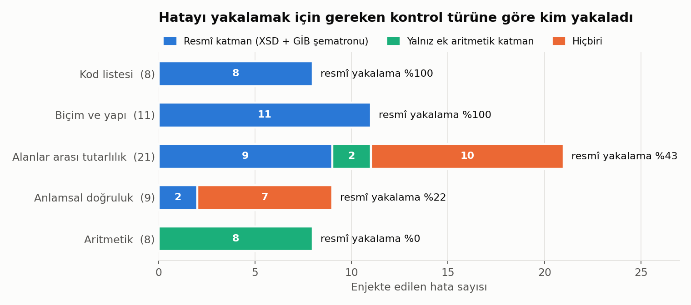

# GİB e-Fatura Doğrulaması Neyi Yakalar, Neyi Kaçırır?

**Soru:** Bir e-fatura GİB'in yayımladığı XSD ve şematron kurallarından geçiyorsa doğru mudur?
**Yöntem:** Mutasyon testi. Dört geçerli faturaya (temel satış, tevkifat, istisna, döviz) gerçek hayatta sık görülen 57 hata tek tek enjekte edildi ve her hatanın hangi katmanda yakalandığı ölçüldü.
**Kurallar:** GİB e-Fatura Paketi 29, UBL-TR 1.2.1, şematron sürümü 20260701 (498 kural). Kurallar [efatura-kontrol](https://github.com/BerkantACUN/efatura-kontrol) motoruyla çalıştırıldı.
**Yeniden üretim:** `make all` (birkaç saniye).

> **English summary.** Mutation test of Turkey's official e-invoice validation (GİB UBL-TR XSD + Schematron, 498 rules). 57 realistic errors were injected one by one into four valid invoices. The official layers caught 30 (53%). They catch 100% of format and code-list errors, but only 43% of cross-field inconsistencies, 22% of semantic errors and 0% of arithmetic errors. 17 errors pass every layer tested, for example a TEVKIFAT (withholding) invoice with no withholding block, an ISTISNA (exempt) invoice charging 20% VAT, an invalid tax-ID checksum, a pre-2023 VAT rate, or an exchange rate off by 1,000×. The published rules validate the *form* of an invoice, not its *correctness*. A pre-submission control layer on the ERP side is required.

---

## Özet

| Hatayı yakalamak için gereken kontrol | Hata sayısı | Resmî katman yakaladı | Yalnız ek aritmetik yakaladı | Hiçbiri |
|---|---:|---:|---:|---:|
| Biçim ve yapı | 11 | **11 (%100)** | 0 | 0 |
| Kod listesi | 8 | **8 (%100)** | 0 | 0 |
| Alanlar arası tutarlılık | 21 | 9 (%43) | 2 | **10** |
| Anlamsal doğruluk | 9 | 2 (%22) | 0 | **7** |
| Aritmetik | 8 | **0 (%0)** | 8 | 0 |
| **Toplam** | **57** | **30 (%53)** | **10** | **17** |



---

## Değerlendirme

**Durum.** GİB'in yayımladığı doğrulama katmanları (UBL 2.1 XSD ve UBL-TR şematronu) 57 hatanın 30'unu reddediyor. Kalan 27 hatalı fatura resmî kurallardan geçiyor. Bunların 10'unu yalnızca, kılavuz tanımlarına göre yazılmış ek bir aritmetik katman yakalıyor. 17'sini test edilen hiçbir katman yakalamıyor.

**Mekanizma.** Yakalama oranı, hatanın türüne göre keskin biçimde değişiyor:

1. **Biçim ve kod listesi kontrolleri eksiksiz.** Uzunluk, karakter kalıbı, zorunlu alan, eleman sırası ve kod listesi üyeliğiyle ilgili 19 hatanın 19'u yakalanıyor. Örnekler: `ADET` birim kodu, `TL` para kodu, küçük harfli seri, listede olmayan tevkifat veya muafiyet kodu.
2. **Aritmetik hiç kontrol edilmiyor.** Satır tutarı ≠ miktar × fiyat, KDV ≠ matrah × oran, ödenecek tutar yanlış, tevkifat düşülmemiş: 8 aritmetik hatanın hiçbiri resmî katmanda reddedilmiyor.
3. **Alanlar arası kurallar tek yönlü.** Belgede tevkifat bloğu varsa şematron fatura tipinin TEVKIFAT olmasını istiyor (T06 yakalanıyor). Tip TEVKIFAT olup tevkifat bloğu hiç yoksa hiçbir kural devreye girmiyor (T01 geçiyor). Tevkifat yalnız satır düzeyindeyse, belge düzeyindeki kural tetiklenmiyor (T08 geçiyor). Aynı örüntü istisnada da var: KDV sıfır olunca muafiyet gerekçesi aranıyor (C06, I06 yakalanıyor), ama tip ISTISNA iken %20 KDV hesaplanması sorun sayılmıyor (I03 geçiyor). Kuralı tetikleyen tip değil, alanın değeri.
4. **Anlamsal doğruluk kapsam dışı.** VKN/TCKN kontrol hanesi, mevzuattaki geçerli KDV oranı ve kurun makullüğü kontrol edilmiyor. Tarih sınırları istisna: gelecek tarih ve 2005 öncesi tarih yakalanıyor.

**Resmî katmanlardan ve ek katmandan geçen 17 hata:**

| # | Kontrol türü | Hata | İş etkisi |
|---|---|---|---|
| T01 | Alanlar arası | TEVKIFAT tipinde tevkifat bloğu yok | Tevkifat uygulanmaz, alıcı fazla öder |
| I03 | Alanlar arası | ISTISNA tipinde KDV %20 hesaplanmış | İstisna uygulanmamış, fazla vergi |
| T08 | Alanlar arası | SATIS tipinde tevkifat yalnız satır düzeyinde | Tip ile içerik çelişkisi |
| H08 | Alanlar arası | İade, satış faturasına eksi satır olarak yazılmış | İade yanlış belge tipiyle |
| D04 | Alanlar arası | Kurun kaynak para birimi, belge para biriminden farklı | Kur yanlış paraya ait |
| D05 | Alanlar arası | Kurun hedef para birimi TRY değil | TL karşılığı yok |
| K07 | Alanlar arası | Satıcı ve alıcı VKN'si aynı | Ana veri hatası |
| B02 | Alanlar arası | Fatura numarasındaki yıl, düzenleme tarihiyle uyumsuz | Seri/yıl karışıklığı |
| B09 | Alanlar arası | Satır sayısı alanı gerçek satır sayısından farklı | Tutarsız başlık |
| B11 | Alanlar arası | İki satır aynı satır numarasına sahip | Satır referansı belirsiz |
| K02 | Anlamsal | Satıcı VKN'si kontrol hanesi yanlış | Var olmayan VKN |
| K03 | Anlamsal | Alıcı VKN'si kontrol hanesi yanlış | KDV indirimi yanlış mükellefe |
| K04 | Anlamsal | Alıcı TCKN'si kontrol hanesi yanlış | Var olmayan kişi |
| C04 | Anlamsal | KDV %18 (Temmuz 2023 öncesi oran), tutarlar tutarlı | Eksik KDV |
| C05 | Anlamsal | KDV %19 (mevzuatta olmayan oran), tutarlar tutarlı | Hatalı vergi |
| H07 | Anlamsal | Tüm tutarlar tutarlı biçimde %10 fazla | İç tutarlı ama yanlış fatura |
| D02 | Anlamsal | Kur 0,0412 (gerçekçi değil) | TL karşılığı 1.000 kat hatalı |

**Kök neden.** Yayımlanan kural seti bir **biçim doğrulayıcısı** olarak tasarlanmış: belgenin GİB tarafından okunup işlenebilir olmasını güvence altına alıyor, faturanın mali açıdan doğru olmasını değil. Aritmetiğin ve mevzuat içeriğinin doğruluğu fiilen düzenleyen tarafa, yani ERP'ye ve entegratöre bırakılmış. Tip-içerik kurallarının tek yönlü yazılması, bu tasarımın en riskli yan etkisi: aynı kural ailesinde bir yön yakalanırken ters yön geçiyor, bu da kullanıcıya yanlış bir güven hissi veriyor.

**Öneri.** GİB'e gönderim öncesinde ERP veya entegratör tarafında, resmî katmanın **tamamlayıcısı** olarak üç kontrol ailesi çalıştırılmalı. Önerilen kontroller ve bu çalışmada kapattıkları hatalar:

| Kontrol ailesi | Kontrol | Kapattığı hata |
|---|---|---|
| Aritmetik | Satır: miktar × fiyat − indirim = satır tutarı; vergi = matrah × oran (kuruşa yuvarlama, ±0,01 tolerans) | H01, H02 |
| | Belge: satır toplamları, vergi alt toplamları, vergiler dahil tutar, ödenecek tutar = vergiler dahil − tevkifat | H03–H06, T04, T05 |
| Alanlar arası | Tip → içerik: TEVKIFAT ise satır ve belge düzeyinde tevkifat zorunlu; ISTISNA ise KDV tutarı 0 | T01, T07, T08, I03 |
| | SATIS/TEVKIFAT/ISTISNA tiplerinde negatif miktar yasak (iade ayrı belgeyle) | H08 |
| | Kur: kaynak = belge para birimi, hedef = TRY; tüm tutarlarda tek para birimi | D03–D05 |
| | Başlık: satır numaraları tekil; LineCountNumeric = satır sayısı; seri yılı = düzenleme yılı; satıcı ≠ alıcı | B02, B09, B11, K07 |
| Anlamsal | VKN ve TCKN kontrol hanesi algoritması ([`src/kimlik.py`](src/kimlik.py)) | K02–K04 |
| | Tarih geçerlilikli KDV oranı tablosu: düzenleme tarihinde yürürlükte olmayan oran reddedilir | C04, C05 |
| | Kur makullük bandı: TCMB kurundan ±%10 sapan kur uyarı verir | D02 |
| | Birim fiyat sapma uyarısı: kalem için geçmiş fiyat ortalamasından ±%X sapma (ana veri) | H07 |

Bu 10 kontrol, testteki 27 kaçırılan hatanın 27'sini kapatıyor. H07 (iç tutarlı ama yanlış fiyat) yalnızca ana veriye dayalı bir uyarıyla yakalanabilir. Herhangi bir belge doğrulayıcısı bu hatayı kesin olarak tespit edemez.

**Kanıt.**
- Tüm sonuçlar: [`reports/mutasyon_sonuclari.csv`](reports/mutasyon_sonuclari.csv). Her satırda hatanın tanımı, yakalayan katman, tetiklenen GİB kural kimliği ve GİB'in özgün mesajı yer alıyor.
- Özet sayılar: [`reports/ozet.json`](reports/ozet.json).
- Hatalı faturaların kendisi: [`mutants/`](mutants/). Her dosya, tabanından tek bir hatayla ayrılır.
- Mutasyon tanımları: [`src/mutations.py`](src/mutations.py).

---

## Sınırlar

- **Yalnızca yayımlanan paket test edildi.** GİB ve özel entegratörler sunucu tarafında ek kontroller yapar: e-fatura kayıtlı kullanıcı sorgusu, UUID tekilliği, imza ve zarf doğrulaması. Örneğin K03 (geçersiz alıcı VKN'si), pratikte kayıtlı kullanıcı sorgusunda yakalanabilir. Bu çalışmanın iddiası "GİB bu faturayı kabul eder" değil, "yayımlanan kurallar bu hatayı tanımıyor"dur.
- **Hata seti yazar tarafından seçildi.** Toplam oran (%53) seçilen hata karmasına bağlıdır. Daha sağlam olan, kontrol türüne göre yakalama oranlarıdır (%100 / %43 / %22 / %0), çünkü her türde birden fazla bağımsız hata var.
- **Ek aritmetik katman resmî değildir.** efatura-kontrol'ün `hesap` katmanı, UBL-TR 1.2.1 Fatura Kılavuzu'ndaki tanımlardan yazılmıştır. Bu çalışmada yalnızca "resmî katmanın kaçırdığı aritmetik hata yakalanabilir mi" sorusunun kanıtı olarak kullanıldı.
- **Kapsam:** TEMELFATURA ve TICARIFATURA; SATIS, TEVKIFAT, ISTISNA tipleri. e-Arşiv, e-İrsaliye, IHRACAT, KAMU ve diğer senaryolar kapsam dışı.
- **Kontrol vakası:** Ödenecek tutarda 1 kuruş fark (H10) bilinçli olarak eklendi ve beklendiği gibi hiçbir katmanda hata üretmedi. Toplamlara dahil edilmedi.

---

## Yeniden üretim

```bash
git clone https://github.com/olcayto-akbudak/efatura-dogrulama-kapsami.git
cd efatura-dogrulama-kapsami
python -m venv .venv && source .venv/bin/activate
pip install -r requirements.txt
make all        # tabanlar → mutasyonlar → doğrulama → grafik
```

```
bases/        dört geçerli taban fatura (ve üretici girdileri)
mutants/      57 hatalı fatura + 1 kontrol vakası
src/
  bases.py      tabanları üretir ve sıfır hatayla doğrulandığını kontrol eder
  mutations.py  hata tanımları ve kontrol türü sınıflaması
  run.py        mutasyon → doğrulama → katman sınıflaması → reports/
  kimlik.py     VKN/TCKN kontrol hanesi algoritmaları
  figures.py    grafik
reports/
  mutasyon_sonuclari.csv, ozet.json, figures/
```

## Kaynak ve lisans

- Kural seti: Gelir İdaresi Başkanlığı, [e-Belge kılavuzları ve paketleri](https://ebelge.gib.gov.tr). Paket sürümleri ve SHA-256 özetleri efatura-kontrol'ün [KAYNAKLAR.md](https://github.com/BerkantACUN/efatura-kontrol/blob/main/KAYNAKLAR.md) dosyasında.
- Doğrulama motoru: [BerkantACUN/efatura-kontrol](https://github.com/BerkantACUN/efatura-kontrol), MIT lisansı, commit `87c0ca0`.
- Bu depodaki kod: MIT lisansı.
- Tüm faturalar sentetiktir. VKN, TCKN ve unvanlar uydurmadır; herhangi bir işverenin veya müşterinin verisini, dokümanını ya da bilgisini içermez.
